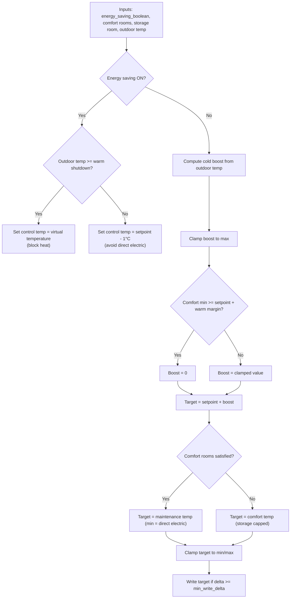

# Blockheat Home Assistant Blueprints

This repo contains a small set of Home Assistant automation blueprints focused
on policy-driven heating control for different devices and setups.

## Blueprints
- `blueprints/automation/blockheat/block-heat.yaml`
  - Outdoor-aware heatpump control with cold-boost logic and energy-saving modes.
- `blueprints/automation/blockheat/daikin-energy-saver.yaml`
  - Direct Daikin climate control that toggles between comfort and saving targets.
- `blueprints/automation/blockheat/energy_saving_policy_bool.yaml`
  - Computes a shared "energy saving" boolean based on Nordpool prices, PV, and
    optional floor temperature.
- `blueprints/automation/blockheat/floor_heat_top_minutes_with_schedule.yaml`
  - Two-state floor heat control (comfort vs soft-off) gated by policy and
    optional comfort schedule with a minimum keep temperature.

## Block Heat (Outdoor-Aware + Efficient Heatpump)
This blueprint controls a heat pump based on an energy-saving policy boolean
plus outdoor temperature and three room sensors (two comfort rooms + storage).

### Context
- Two comfort rooms are controlled to the same target temperature.
- A storage/buffer room can store heat and is capped to avoid overheating.
- Outdoor temperature is used to increase heating effort when needed.
- The heatpump setpoint is 20 °C by default.

### Behavior Summary
- **Energy saving = OFF**
  - Compute a cold-boost from outdoor temperature.
  - Apply boost, but suppress it if the coldest comfort room is already warm.
  - Maintain comfort until both comfort rooms are satisfied, then drop to
    maintenance target unless the storage room is below its target.
  - Storage room is monitored and capped, but does not stop comfort heating.
  - Clamp to min/max and only write if the change is significant.

- **Energy saving = ON**
  - If outdoor temperature is **warm (>= 7 °C)**, fully block heating by writing
    the virtual temperature.
  - If outdoor temperature is **cold**, set control temperature to **setpoint - 1 °C**
    to avoid direct electric heating and favor compressor efficiency.

### Default Parameters
- Heatpump setpoint: 20 °C
- Cold boost threshold: 0 °C
- Max boost: +3 °C
- Boost slope: 1 °C boost per 5 °C drop
- Indoor warm margin: 0.3 °C
- Warm shutdown threshold (energy saving): 7 °C
- Comfort target: 22 °C
- Comfort → heatpump offset: 2 °C
- Storage → heatpump offset: 2 °C
- Storage cap: 25 °C
- Storage target: 25 °C
- Maintenance target/min: 20 °C / 19 °C
- Electric assist: 30 min below target by 0.5 °C, min control 18 °C

### Example
- Outdoor = -10 °C
- Cold boost = (0 - (-10)) / 5 = 2 °C
- Target = 20 + 2 = 22 °C (unless the coldest comfort room is already warm)

### Flowchart

### Electric Assist
The blueprint can allow a lower control temperature to trigger direct electric
heating when the compressor cannot keep up. It activates only after the coldest
comfort room has been below target by the configured delta for the configured
duration.
Electric assist is always allowed when the fallback criteria are met.
The cooldown is enforced using an input_datetime helper configured in the
blueprint inputs.

### Diagnostics Card (Dashboard)
A screenshot-friendly diagnostics card is available at:
- `dashboards/blockheat/block-heat-diagnostics-card.yaml`

To use it:
1. Copy the YAML into a Lovelace manual card or view YAML editor.
2. Replace the `auto` value in the markdown card with your automation entity id.
3. Replace the placeholder entity ids in the entities list with your actual sensors.

The markdown block computes the same target logic as the blueprint so you can
verify comfort status, cold-boost, storage behavior, and electric fallback
eligibility at a glance.

## Daikin Energy Saver (Policy-Driven)
This blueprint targets a Daikin climate entity and switches between a normal
temperature and a saving temperature based on the Energy Saving Policy boolean,
with an optional outdoor temperature guard and minimum change threshold.

## Energy Saving Policy (Top-N Price Windows)
Computes when to "save energy" (ON) vs "don't care" (OFF) by selecting the
day's most expensive 15-minute slots, with overrides for low price, high PV, or
optionally low floor temperature. Writes to an input_boolean and can run
actions on toggle.

## Floor Heat (Two-State + Schedule + Min Keep)
Controls a floor-heat thermostat using the Energy Saving Policy boolean:
soft-off during saving, comfort during non-saving. Optionally gates comfort with
a schedule and maintains a minimum keep temperature when the schedule is off.
