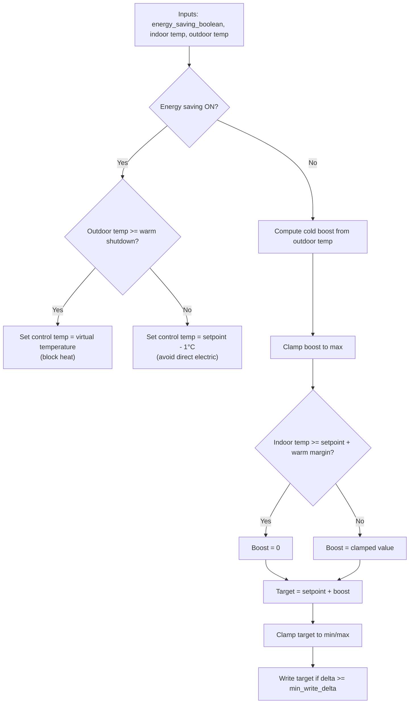

# Blockheat (Outdoor-Aware + Efficient Heatpump)

This project provides a Home Assistant automation blueprint that controls a heat
pump based on an energy-saving policy boolean plus indoor/outdoor temperatures.

## Context
- The primary indoor sensor is in a bathroom with stone tiles used as thermal
  storage.
- Other rooms cool faster when it is very cold outside, so outdoor temperature
  is used to increase heating effort when needed.
- The heatpump setpoint is 20 °C by default.

## Behavior Summary
- **Energy saving = OFF**
  - Compute a cold-boost from outdoor temperature.
  - Add boost to setpoint, but suppress it if the bathroom is already warm.
  - Clamp to min/max and only write if the change is significant.

- **Energy saving = ON**
  - If outdoor temperature is **warm (>= 7 °C)**, fully block heating by writing
    the virtual temperature.
  - If outdoor temperature is **cold**, set control temperature to **setpoint - 1 °C**
    to avoid direct electric heating and favor compressor efficiency.

## Default Parameters
- Heatpump setpoint: 20 °C
- Cold boost threshold: 0 °C
- Max boost: +3 °C
- Boost slope: 1 °C boost per 5 °C drop
- Indoor warm margin: 0.3 °C
- Warm shutdown threshold (energy saving): 7 °C

## Example
- Outdoor = -10 °C
- Cold boost = (0 - (-10)) / 5 = 2 °C
- Target = 20 + 2 = 22 °C (unless bathroom is already warm)

## Flowchart

## Files
- Blueprint: `blueprints/automation/blockheat/block-heat.yaml`
- Blueprint: `blueprints/automation/blockheat/daikin-energy-saver.yaml`

## Daikin Energy Saver (Policy-Driven)
This additional blueprint targets the Daikin climate entity directly and
switches between a normal temperature and a saving temperature based on the
Energy Saving Policy input_boolean, with an optional outdoor temperature guard.
