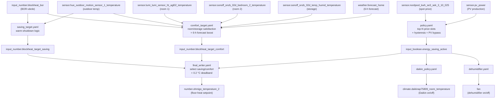

# Blockheat automation replacement

Native HA automations replacing the unavailable blockheat HACS integration.

## Device roles

| Device | Entity | Policy |
|---|---|---|
| **Ohmigo** floor-heat thermostat | `number.ohmigo_temperature_2` | Controls the whole-house floor-heating heat pump. Ohmigo reports a **fake room temperature** to the heat pump, which compares it against its BOR-värde (from `input_number.blockheat_bor`). Values **below** BOR make the heat pump run; values **above** BOR make it stop. This is inverse to a normal setpoint. |
| **Daikin** AC/heat pump | `climate.daikinap75809_room_temperature` | Living-room AC unit. Turned on/off by the energy-saving flag only. HVAC mode (heat/cool) is managed by separate automations and is never overridden here. |

The two devices are **independent** — the Daikin policy does not affect the Ohmigo setpoint calculations, and vice versa.

## Data flow



## Files

| File | Purpose |
|---|---|
| `helpers.yaml` | Defines 4 helpers (input_boolean + 3 input_number) |
| `policy.yaml` | Energy-saving policy: top-N price slots + hysteresis |
| `saving_target.yaml` | Ohmigo saving-mode temperature target |
| `comfort_target.yaml` | Ohmigo comfort target with 6-hour forecast preheating |
| `final_writer.yaml` | Writes Ohmigo setpoint with deadband |
| `daikin_policy.yaml` | Daikin on/off per energy-saving flag |
| `dehumidifier.yaml` | Dehumidifier control (updated entity reference) |

> **Note:** `comfort_target.yaml` uses `weather.get_forecasts` which requires HA 2023.9+.

## Applying via MCP

### 1. Create helpers

```python
# input_boolean.energy_saving_active
ha_config_set_helper(
    helper_type="input_boolean",
    name="energy_saving_active",
    icon="mdi:lightning-bolt",
)

# input_number.blockheat_bor
ha_config_set_helper(
    helper_type="input_number",
    name="blockheat_bor",
    min=18, max=26, step=0.5,
    unit_of_measurement="°C",
    icon="mdi:thermostat",
    mode="box",
)

# input_number.blockheat_target_saving
ha_config_set_helper(
    helper_type="input_number",
    name="blockheat_target_saving",
    min=10, max=26, step=0.1,
    unit_of_measurement="°C",
    icon="mdi:thermometer-low",
    mode="box",
)

# input_number.blockheat_target_comfort
ha_config_set_helper(
    helper_type="input_number",
    name="blockheat_target_comfort",
    min=10, max=26, step=0.1,
    unit_of_measurement="°C",
    icon="mdi:thermometer-high",
    mode="box",
)
```

### 2. Remove broken legacy automation

```python
ha_config_remove_automation("automation.blockheat_comfort")  # if it exists
```

### 3. Apply automations

Apply each YAML file via `ha_config_set_automation`. Use the content of each
`.yaml` file in this directory.

Order matters for initial population:
1. `saving_target.yaml` — populate saving target
2. `comfort_target.yaml` — populate comfort target
3. `policy.yaml` — evaluate policy
4. `final_writer.yaml` — write Ohmigo setpoint
5. `daikin_policy.yaml` — apply Daikin on/off state
6. `dehumidifier.yaml` — replace old dehumidifier automation

### 4. Verify

```python
# Confirm helpers exist
ha_get_state("input_boolean.energy_saving_active")
ha_get_state("input_number.blockheat_bor")
ha_get_state("input_number.blockheat_target_saving")
ha_get_state("input_number.blockheat_target_comfort")

# Trigger policy and confirm results
ha_call_service("automation.trigger", {"entity_id": "automation.blockheat_energy_saving_policy"})
# Check input_boolean.energy_saving_active reflects price vs cutoff
# Check number.ohmigo_temperature_2 matches expected setpoint (±0.2 °C deadband)
```

## Parameters used

| Parameter | Value |
|---|---|
| minutes_to_block | 240 min → 16 slots |
| price_ignore_below | 0.6 SEK/kWh |
| pv_ignore_above_w | 3000 W |
| saving_offset_c | 0.5 °C (below BOR during saving) |
| warm_shutdown_outdoor | 8.0 °C |
| warm_shutdown_hysteresis_c | 1.0 °C |
| bor_c | from `input_number.blockheat_bor` (heat pump BOR-värde, default 22.0 °C) |
| comfort_target_c | 22.0 °C (desired room temp) |
| storage_target_c | 25.0 °C |
| comfort_margin_c | 0.25 °C |
| cold_threshold | 2.0 °C |
| max_boost | 3.0 °C |
| boost_slope_c | 4.0 |
| control_min_c | 10.0 °C |
| control_max_c | 26.0 °C |
| min_toggle_interval_min | 15 |
| price_hysteresis_fraction | 0.05 (5%) |
| control_write_delta_c | 0.2 °C |
